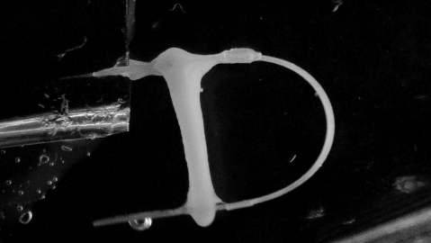

# cardiac-tissue-force-measurement
Takes a video of an engineered cardiac tissue beating against a bent polymer strip, detects positions of the strip and the tissue, and outputs force and strain generated by the tissue

Main file is read_play_mov.m

Here is an example of what an engineered cardiac tissue attached to an elastic strip looks like:

The code processes the input video frame-by-frame, detecting the points of tissue attachement and generating plots of tissue length, strip bending angle, and the force generated by  the tissue:

Tissue length (mm) vs time (s):

Strip angle (degrees) vs. time (s):

Bending force (N) vs. time (s):

Finally, you can watch the processed video showing the detected features by playing combined video.avi
